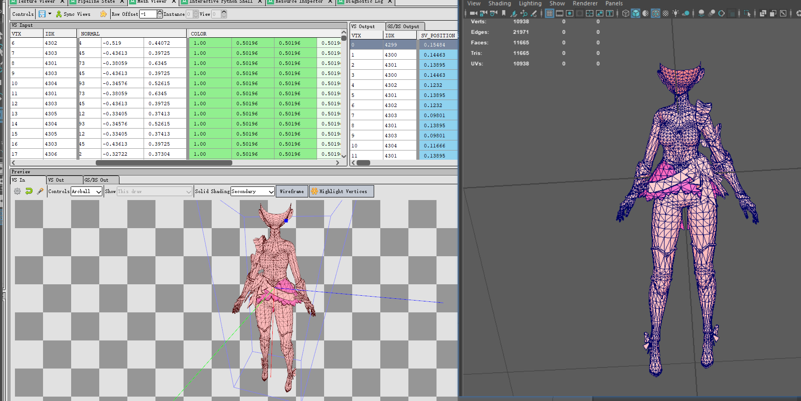
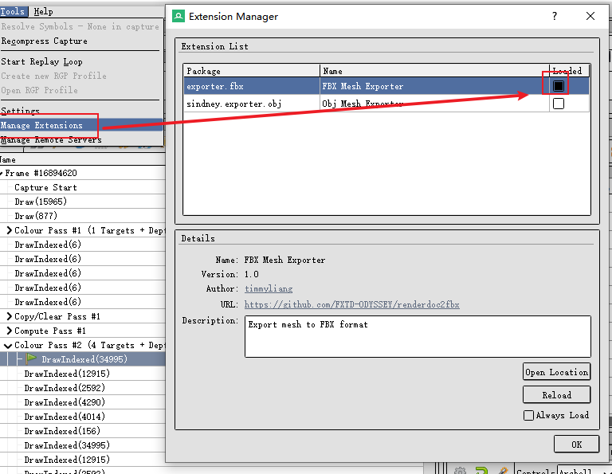
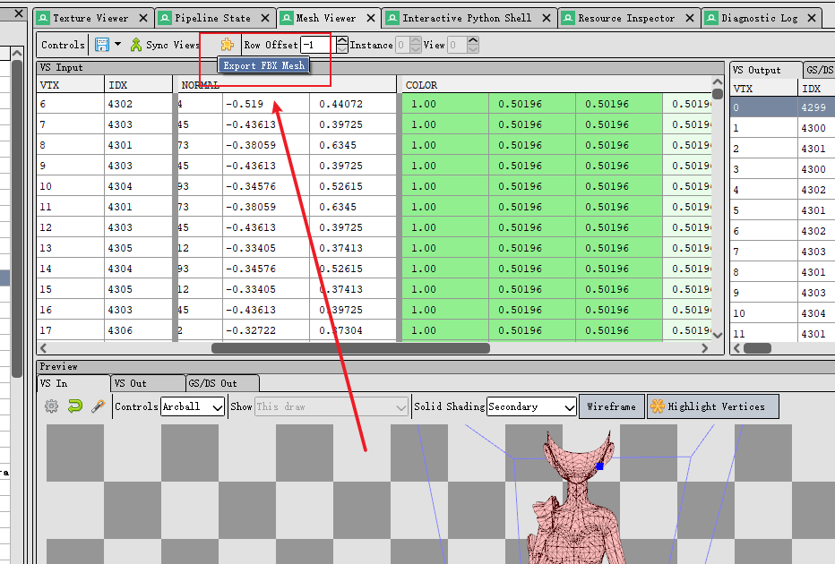

# renderdoc2fbx
renderdoc python extension for exporting fbx data

## Installation

copy `fbx_exporter` folder to `%appdata%\qrenderdoc\extensions`

If you are in the windows platform, you can use `install.bat` to install the extension.

## Feature

Export ASCII FBX File Support

+ **Vertex** 
+ **Normal** 
+ **UV**
+ **Tangent**
+ **VertexColor**

## Usage

make sure you copy the extension to the `%appdata%\qrenderdoc\extensions` directory

launch `renderdoc` and open the `Extension Manager`

then go to the Mesh Viewer click the extension icon menu to export the current data as the FBX file.

## Notice 

~~Export Large Mesh especially more than 30000 vertices need several seconds~~  
~~Python extension not efficient enough for that large Mesh. ~~

I change the export method which greatly enhance the export performance. 
